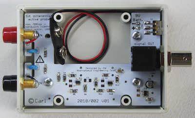
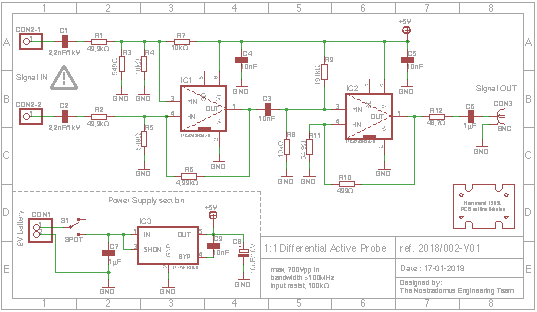
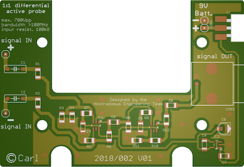

# LabTools : 100MHz+ Differential Probe

## What

This repository describes how to build your own differential oscilloscope probe. In the respective folders you can find all necessary files to have the pcb produced, drawings on how to prepare the enclosure for final built-in, and detailed datasheets  on the used components.

## Why

A couple of years ago I built a [basic differential probe, limited to 1MHz/700Vpp input signals](https://github.com/nostradomus/LabTools_1MHz-Differential-Probe). The design was entirely done with through-hole components on a single-sided pcb. As technology and material have significantly gotten better over the years, I decided to build an improved version with better [specifications](#Input-specifications), based on modern SMD components.

## How

Being the proud owner of both the [Horowitz & Hill's "The Art of Electronics"](https://artofelectronics.net) and the [Linear Technology's "Analog Circuit Design" trilogy](http://www.linear.com/designtools/acd_book.php), I started reading to find a good solution for a state-of-art roll-your-own differential oscilloscope probe. Soon I found out that Linear Technology was not only having the right components, but was also having some very enlightening application notes, almost completely covering what I needed. As the schematic for a [differential amplifier](https://en.wikipedia.org/wiki/Differential_amplifier) is very well-documented in LT's design note collection, I could start designing the pcb almost right away. However, a lot of attention was needed for the specific design constraints, as explained in the respective paragraph of the [opamp's datasheet](pdf-files/datasheet_-_LTC6268-10.pdf) on page 16. As a cherry on the cake, Linear Technology has been so kind to sample some chips for the prototype. The key components for this project concern two [LTC6268-10 4GHz FET-input operational amplifiers with extremely low input bias current and low input capacitance](pdf-files/datasheet_-_LTC6268-10.pdf), and an [LT1761 low noise, LDO micropower regulator](pdf-files/datasheet_-_LT1761.pdf). An extended [design note](pdf-files/designnotes - LT1761.pdf) concerning the LDO can be found in Analog Circuit Design Volume 3, chapter 166, or on the [LT website](http://www.linear.com/product/LT1761). More [in-depth theory](pdf-files/applicationnote_-_LT1761.pdf) on this particular LDO is also available in Analog Circuit Design Volume 1, section 3, chapter 12.

### A differential probe, what is it all about ?

...publication in progress...

## Progress status

 - [x] have a [need](#why)
 - [x] define the technical [specifications](#Input-specifications)
 - [x] decide on what is should [look](#how) like
 - [ ] create drawings for the [housing](#mechanical-construction)
 - [ ] [test and validate](#Demo-setup-and-measurements) the concept
 - [ ] publish the [schematic and explain the electronics](#Electronics)
 - [x] publish production files for the [electronics board](#Printed-circuit-board) board
 - [ ] write [end-user documentation](https://github.com/nostradomus/100MHz+_Differential_Probe/wiki)

## Technical details

### Input specifications

- (over) 100MHz off bandwith
- 100kΩ input resistance
- max 700Vpp or 2500Vpp (depending on C1,C2)

### Electronics

#### Printed circuit board

#### Demo setup and measurements

...publication in progress...

### Mechanical construction

The bases for the housing is an abs handheld instrument enclosure from the [1593 series](https://www.hammfg.com/electronics/small-case/plastic/1593), fabricated by [Hammond manufacturing](https://www.hammfg.com/), more specifically [1593LGY](pdf-files/) (grey-coloured, with two removable end-plates).

The pcb for the probe has been designed in such a way that it can be fixed with four screws to the bottom of the enclosure. On the side of the pcb, cut-outs have been foreseen for the holes that allow to screw the bottom and top of the enclosure together. The large rectangle cut-out fits a [9V block battery](pdf-files/datasheet_-_9v-alkaline.pdf) which serves as power supply for the probe. A T-shaped groove on the input-side protects the circuitry from arcing  and creep when higher input voltages are applied (please implement all safety precautions as explained in the [electronics](#Electronics) and [building](#Building-instructions) paragraphs when working with potential differences which are higher than 48V-to-earth).

### Building instructions

...publication in progress...

## Contributors

If you are having any good suggestions, just drop me a line [:email:](http://nostradomus.ddns.net/contactform.html).
If feasible, I'll be happy to implement proposed improvements.
And if you are having lots of time, I'll be happy to share the work with you ;-).

When you create your own version, don't forget to send us some nice pictures of your construction. We'll be happy to publish them in the :confetti_ball:Hall of Fame:confetti_ball:.

## :globe_with_meridians: License

At this moment, there is no specific license attached to this project yet.

So, today, if you like it, have fun with it (at your own risk of course :-D), and especially, be creative.

Oh, and when using anything from this repository, it is highly appreciated if you mention its origin.

If you would like to use any of this work (or the whole project) for commercial use, first [contact us :email:](http://nostradomus.ddns.net/contactform.html), so we can add the appropriate license, which best fits your business.
