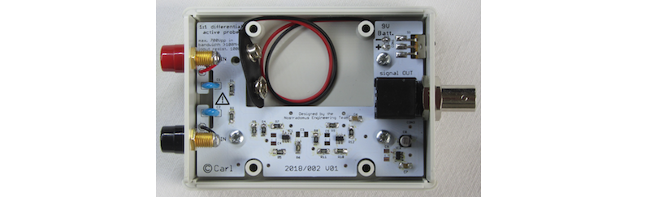

# LabTools : 100MHz+ Differential Probe

## What

...publication in progress...

## Why

...publication in progress...

## How

...publication in progress...

## Progress status

 - [x] have a [need](#why)
 - [x] define the technical [specifications](#Input-specifications)
 - [x] decide on what is should [look](#how) like
 - [ ] create drawings for the [housing](#mechanical-construction)
 - [ ] [test and validate](#Demo-setup-and-measurements) the concept
 - [ ] publish the [schematic and explain the electronics](#Electronics)
 - [x] publish production files for the [electronics board](#Printed-circuit-board) board
 - [ ] write [end-user documentation](https://github.com/nostradomus/100MHz+_Differential_Probe/wiki)

## Technical details

### Input specifications

- (over) 100MHz off bandwith
- 100kΩ input resistance
- max 700Vpp or 2500Vpp (depending on C1,C2)

### Electronics

...publication in progress...

#### Printed circuit board

...publication in progress...

#### Demo setup and measurements

...publication in progress...

### Mechanical construction

The bases for the housing is an abs handheld instrument enclosure from the [1593 series](https://www.hammfg.com/electronics/small-case/plastic/1593), fabricated by [Hammond manufacturing](https://www.hammfg.com/), more specifically [1593LGY](pdf-files/) (grey-coloured, with two removable end-plates).

The pcb for the probe has been designed in such a way that it can be fixed with four screws to the bottom of the enclosure. On the side of the pcb, cut-outs have been foreseen for the holes that allow to screw the bottom and top of the enclosure together. The large rectangle cut-out fits a [9V block battery](pdf-files/datasheet_-_9v-alkaline.pdf) which serves as power supply for the probe. A T-shaped groove on the input-side protects the circuitry from arcing  and creep when higher input voltages are applied (please implement all safety precautions as explained in the [electronics](#Electronics) and [building](#Building-instructions) paragraphs when working with potential differences which are higher than 48V-to-earth).

### Building instructions

...publication in progress...

## Contributors

If you are having any good suggestions, just drop me a line [:email:](http://nostradomus.ddns.net/contactform.html).
If feasible, I'll be happy to implement proposed improvements.
And if you are having lots of time, I'll be happy to share the work with you ;-).

When you create your own version, don't forget to send us some nice pictures of your construction. We'll be happy to publish them in the :confetti_ball:Hall of Fame:confetti_ball:.

## :globe_with_meridians: License

At this moment, there is no specific license attached to this project yet.

So, today, if you like it, have fun with it (at your own risk of course :-D), and especially, be creative.

Oh, and when using anything from this repository, it is highly appreciated if you mention its origin.

If you would like to use any of this work (or the whole project) for commercial use, first [contact us :email:](http://nostradomus.ddns.net/contactform.html), so we can add the appropriate license, which best fits your business.
