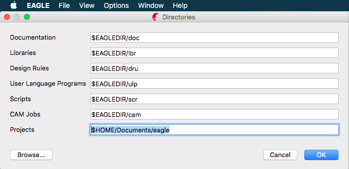

This folder will contain all files required to open the project in the EAGLE PCB software [(download here)](http://www.autodesk.com/products/eagle/free-download) : 

 - .epf : the project file as main entry point (is connected with the description file)
 - .sch : schematic file
 - .brd : pcb layout file
 
 These files should (grouped in a folder) either be copied in Eagle's project directory (see below image of the settings window). The Eagle directory settings also accept multiple paths. The Eagle syntax requires columns as path separators.

