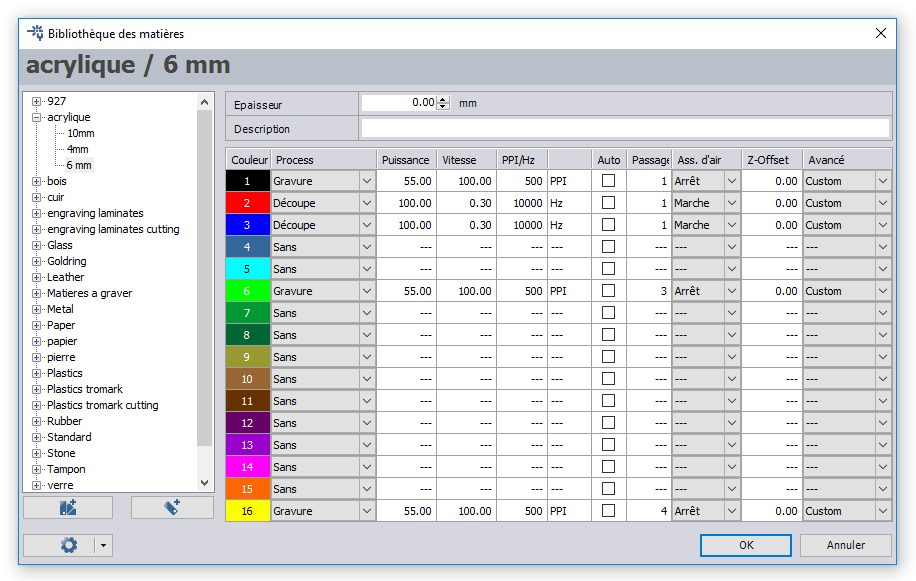

This folder contains all files required to laser-cut and engrave the plexi plates for the housing.

For the initial built, both 3 and 6 mm plexi material has been used.

When using other thicknesses, the length of the srews, bolts and buttons should be adapted.

The .cdr-files have been created with CorelDraw (X6), and have been optimized for [Trotec laser and engraving machines](https://www.troteclaser.com/en/). Several specific RGB-colors (compatible with this machine's driver) have been used :

color  | RGB-code    | function             | comments
-------|-------------|----------------------|---------
black  | (0,0,0)     | engraving            | 1 pass, basic text and outline
green  | (0,255,0)   | deep engraving       | 5 passes, LED windows
yellow | (255,255,0) | additional engraving | 1 pass, text on LED windows
red    | (255,0,0)   | internal cut-outs    |
blue   | (0,0,255)   | outline cut          |

It is important to perform the jobs in the above order for optimal visual effect. The black/green/yellow layers should not overlap for the multi-step engraving, as this is not supported by the Trotec driver. Alternatively, the engraving can be done in sequential jobs. However the exact positioning of the laser is crucial in that case. Internal cut-outs are always done before the outline cut, for mechanical stability of the plexi plate in the laser cutting machine.

The cutting and engraving have been performed on a [Trotec Speedy 100R](https://www.troteclaser.com/en/laser-machines/laser-engravers-speedy-series/) with 30W laser. To obtain the same result as the author of this project, you should use the settings as shown in below screenshot, or extrapolate towards to the power rating of your laser.



The compressed file [```digital-font.zip```](digital-font.zip) contains part of the .ttf font-files which have been used for the engraving. They might not be installed on your system. It concerns a free (for personal use) font which was downloaded from the internet somewhere in the 20th century, for which unfortunately the referring website does not exist anymore (http://digitalfont.hypermart.net). The second font, which is used for the optional training front plate, should be part of your operating system. If not, it is available in [```OCR-font.zip```](OCR-font.zip).

